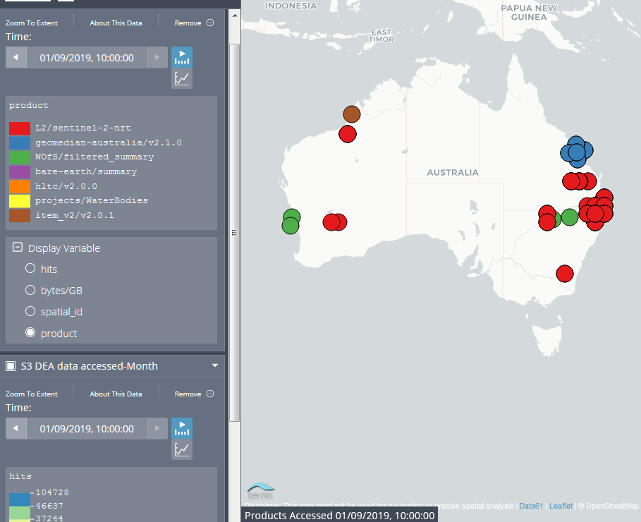

# dea-data
Generate user statistics for data stored in AWS S3

This is an overview of which products are accessed and downloaded from  
`dea-public-data`  from AWS s3 bucket 

The main idea of this project is get 
- Products accessed for the month
- Area of interest 
- Tiles accessed by the reference of spatial ID 

### Packages 

Please install the conda environment based on the `conda-maps.txt` present in this repository to get started 

### Data Availability 

All the data are downloaded from s3 bucket named s3-monitoring in dev bucket s3 

To go a bit detail how this data is uploaded to S3 bucket:

- Monthly data csvs generated in <https://www.s3stat.com/>( please consult autobots team for the account access) 
- Run a lambda serverless application on `dea-orchestration` repo under `s3-stat` branch 
- This will upload the monthly and weekly json files to AWS Dev S3 bucket `s3stat-monitoring`
- Under the `s3-stat-monitoring` bucket there is a `stats` directory which holds all the monthly and weekly json data of dea-s3 bucket
- Download the monthly file for eg `201909.json`
- Run the notebook `data-all-product.ipynb` to generate the monthly csv on dev bucket again 
- Terria automatically picks up the changes in `data.csv` and plots the products as shown below 

